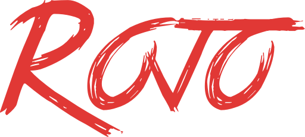

    

&nbsp;

    
    
    

**Rojo** is a tool designed to enable Roblox developers to use professional-grade software engineering tools.

With Rojo, it's possible to use industry-leading tools like **Visual Studio Code** and **Git**.

Rojo is designed for power users who want to use the best tools available for building games, libraries, and plugins.

## Features
Rojo enables:

* Working on scripts and models from the filesystem, in your favorite editor
* Versioning your game, library, or plugin using Git or another VCS
* Streaming `rbxmx` and `rbxm` models into your game in real time
* Packaging and deploying your project to Roblox.com from the command line
* Pulling Instances from Roblox place and model files back into an existing Rojo project with `rojo syncback`

Rojo also has an optional two-way sync setting in the Studio plugin for syncing supported Studio edits back to the filesystem.

Some workflows, like fully automatic conversion of every existing game into a Rojo project, are still limited and may require manual project configuration.

## [Documentation](https://rojo.space/docs)
Documentation is hosted in the [rojo.space repository](https://github.com/rojo-rbx/rojo.space).

## Contributing
Check out our [contribution guide](CONTRIBUTING.md) for detailed instructions for helping work on Rojo!

Pull requests are welcome!

Rojo supports Rust 1.88 and newer. The minimum supported version of Rust is based on the latest versions of the dependencies that Rojo has.

## License
Rojo is available under the terms of the Mozilla Public License, Version 2.0. See [LICENSE.txt](LICENSE.txt) for details.
