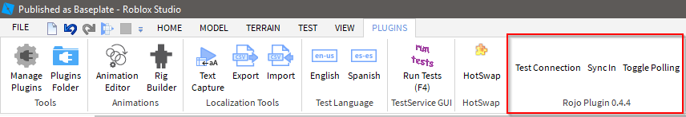
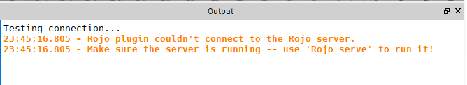

# Creating a Project
To use Rojo, you'll need to create a new project file, which tells Rojo what your project is, and how to load it into Roblox Studio.

## New Project
Create a new folder, then run `rojo init` inside that folder to initialize an empty project.

```sh
mkdir my-new-project
cd my-new-project

rojo init
```

Rojo will create an empty project file named `rojo.json` in the directory.

The default configuration doesn't do anything. We need to tell Rojo where our code is on the filesystem, and where we want to put it in the Roblox tree.

To do that, open up `rojo.json` and add an entry to the `partitions` table:

```json
{
    "name": "your-project-name-here",
    "servePort": 8000,
    "partitions": {
        "src": {
            "path": "src",
            "target": "ReplicatedStorage.Project"
        }
    }
}
```

!!! warning
    Make sure that the `src` directory exists in your project, or Rojo will throw an error!

!!! warning
    Any objects contained in the `target` of a partition will be destroyed by Rojo if not found on the filesystem!

A Rojo project has one or more *partitions*. Partitions define how code should be transferred between the filesystem and Roblox by mapping directories and files to Roblox objects.

Each partition has:

* A name (the key in the `partitions` object), which is used for debugging
* `path`, the location on the filesystem relative to `rojo.json`
* `target`, the location in Roblox relative to `game`

## Syncing into Studio

Once you've added your partition to the project file, you can start the Rojo dev server by running a command in your project's directory:

```sh
rojo serve
```

If your project is in the right place, Rojo will let you know that it was found and start an HTTP server that the plugin can connect to.

In Roblox Studio, open the plugins tab and find Rojo's buttons.


{: align="center" }

Press **Test Connection** to verify that the plugin can communicate with the dev server. Watch the Output panel for the results.

!!! info
    If you see an error message, return to the previous steps and make sure that the Rojo dev server is running.

    
    {: align="center" }

After your connection was successful, press **Sync In** to move code from the filesystem into Studio, or use **Toggle Polling** to have Rojo automatically sync in changes as they happen.

## Importing an Existing Project
Rojo will eventually support importing an existing Roblox project onto the filesystem for use with Rojo.

Rojo doesn't currently support converting an existing project or syncing files from Roblox Studio onto the filesystem. In the mean time, you can manually copy your files into the structure that Rojo expects.

Up-to-date information will be available on [issue #5](https://github.com/LPGhatguy/rojo/issues/5) as this is worked on.