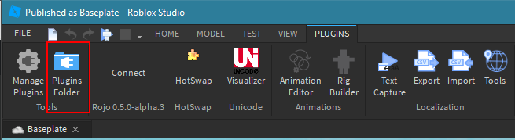

This is this installation guide for Rojo **0.5.x**.

[TOC]

## Overview
Rojo has two components:

* The command line interface (CLI)
* The Roblox Studio plugin

!!! info
    It's important that your installed version of the plugin and CLI are compatible.

    The plugin will show errors in the Roblox Studio output window if there is a version mismatch.

## Installing the CLI

### Installing from GitHub
If you're on Windows, there are pre-built binaries available from Rojo's [GitHub Releases page](https://github.com/LPGhatguy/rojo/releases).

The Rojo CLI must be run from the command line, like Terminal.app on MacOS or `cmd.exe` on Windows. It's recommended that you put the Rojo CLI executable on your `PATH` to make this easier.

### Installing from Cargo
If you have Rust installed, the easiest way to get Rojo is with Cargo!

To install the latest 0.5.0 alpha, use:

```sh
cargo install rojo --version 0.5.0-alpha.11
```

## Installing the Plugin

### Installing from GitHub
The Rojo Roblox Studio plugin is available from Rojo's [GitHub Releases page](https://github.com/LPGhatguy/rojo/releases).

Download the attached `rbxm` file and put it into your Roblox Studio plugins folder. You can find that folder by pressing **Plugins Folder** from your Plugins toolbar in Roblox Studio:


{: align="center" }

### Installing from Roblox.com
Visit [Rojo's Roblox.com Plugin page](https://www.roblox.com/library/1997686364/Rojo-0-5-0-alpha-3) in Roblox Studio and press **Install**.

## Visual Studio Code Extension
If you use Visual Studio Code, you can install [Evaera's unofficial Rojo extension](https://marketplace.visualstudio.com/items?itemName=evaera.vscode-rojo), which will install both halves of Rojo for you. It even has a nifty UI to sync files and start/stop the Rojo server!