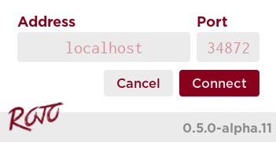

[TOC]

## Creating the Rojo Project
To use Rojo to build a game, you'll need to create a new project file, which tells Rojo how to turn your files into a Roblox place.

First, create a new folder to contain the files for your game and open up a new terminal inside of it, like cmd.exe or Bash.

It's convenient to make the folder from the command line:

```sh
mkdir my-new-project
cd my-new-project
```

Inside the folder, initialize a new Rojo project:

```sh
rojo init
```

Rojo will make a small project file in your directory, named `default.project.json`. It matches the "Baseplate" template from Roblox Studio, except that it'll take any files you put in a folder called `src` and put it into `ReplicatedStorage.Source`.

Speaking of files, make sure to create a directory named `src` in this folder, or Rojo will be upset about missing files!

```sh
mkdir src
```

Let's also add a Lua file, `hello.lua` to the `src` folder, so that we can make this project our own.

```sh
echo 'return "Hello, Rojo!"' > src/hello.lua
```

## Building Your Place
Now that we have a project, one thing we can do is build a Roblox place file for our project. This is a great way to get started with a project quickly with no fuss.

All we have to do is call `rojo build`:

```sh
rojo build -o MyNewProject.rbxlx
```

If you open `MyNewProject.rbxlx` in Roblox Studio now, you should see a `Folder` containing a `ModuleScript` under `ReplicatedStorage`!

!!! info
    To generate a binary place file instead, use `rbxl`. Note that support for binary model/place files (`rbxm` and `rbxl`) is very limited in Rojo presently.

## Live-Syncing into Studio
Building a place file is great for starting to work on a game, but for active iteration, you'll want something faster.

In Roblox Studio, make sure the Rojo plugin is installed. If you need it, check out [the installation guide](installation) to learn how to install it.

To expose your project to the plugin, you'll need to start a new **live sync session** from the command line:

```sh
rojo serve
```

You should see output like this in your terminal:

```sh
$ rojo serve
Rojo server listening on port 34872
```

Switch into Roblox Studio and press the **Connect** button on the Rojo plugin toolbar. A dialog should appear:


{: class="feature-image" align="center" }

If the port number doesn't match the output from the command line, change it, and then press **Connect**.

If all went well, you should now be able to change files in the `src` directory and watch them sync into Roblox Studio in real time!

## Uploading Your Place
Aimed at teams that want serious levels of automation, Rojo can upload places to Roblox.com automatically.

You'll need an existing game on Roblox.com as well as the `.ROBLOSECURITY` cookie of an account that has write access to that game.

!!! warning
    It's recommended that you set up a Roblox account dedicated to deploying your game instead of your personal account in case your security cookie is compromised.

Generating and publishing your game is as simple as:

```sh
rojo upload --asset_id [PLACE ID] --cookie "[SECURITY COOKIE]"
```

An example project is available on GitHub that deploys to Roblox.com from GitHub and Travis-CI automatically: [https://github.com/LPGhatguy/roads](https://github.com/LPGhatguy/roads)