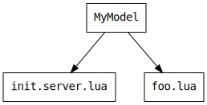

This page aims to describe how Rojo turns files on the filesystem into Roblox objects.

[TOC]

## Overview
| File Name      | Instance Type             |
| -------------- | ------------------------- |
| any directory  | `Folder`                  |
| `*.server.lua` | `Script`                  |
| `*.client.lua` | `LocalScript`             |
| `*.lua`        | `ModuleScript`            |
| `*.csv`        | `LocalizationTable`       |
| `*.txt`        | `StringValue`             |
| `*.model.json` | Any                       |
| `*.rbxm`       | Any                       |
| `*.rbxmx`      | Any                       |
| `*.meta.json`  | Modifies another instance |

## Limitations
Not all property types can be synced by Rojo in real-time due to limitations of the Roblox Studio plugin API. In these cases, you can usually generate a place file and open it when you start working on a project.

Some common cases you might hit are:

* Binary data (Terrain, CSG, CollectionService tags)
* `MeshPart.MeshId`
* `HttpService.HttpEnabled`

For a list of all property types that Rojo can reason about, both when live-syncing and when building place files, look at [rbx-dom's type coverage chart](https://github.com/rojo-rbx/rbx-dom#property-type-coverage).

This limitation may be solved by [issue #205](https://github.com/rojo-rbx/rojo/issues/205) in the future.

## Folders
Any directory on the filesystem will turn into a `Folder` instance unless it contains an 'init' script, described below.

## Scripts
The default script type in Rojo projects is `ModuleScript`, since most scripts in well-structued Roblox projects will be modules.

If a directory contains a file named `init.server.lua`, `init.client.lua`, or `init.lua`, that folder will be transformed into a `*Script` instance with the contents of the 'init' file. This can be used to create scripts inside of scripts.

For example, these files:


{: align="center" }

Will turn into these instances in Roblox:


{: align="center" }

## Localization Tables
Any CSV files are transformed into `LocalizationTable` instances. Rojo expects these files to follow the same format that Roblox does when importing and exporting localization information.

## Plain Text Files
Plain text files (`.txt`) files are transformed into `StringValue` instances. This is useful for bringing in text data that can be read by scripts at runtime.

## JSON Models
Files ending in `.model.json` can be used to describe simple models. They're designed to be hand-written and are useful for instances like `RemoteEvent`.

A JSON model describing a folder containing a `Part` and a `RemoteEvent` could be described as:

```json
{
    "Name": "My Cool Model",
    "ClassName": "Folder",
    "Children": [
        {
            "Name": "RootPart",
            "ClassName": "Part",
            "Properties": {
                "Size": {
                    "Type": "Vector3",
                    "Value": [4, 4, 4]
                }
            }
        },
        {
            "Name": "SendMoney",
            "ClassName": "RemoteEvent"
        }
    ]
}
```

It would turn into instances in this shape:


{: align="center" }

!!! warning
    Starting in Rojo 0.5.0 (stable), the `Name` field is no longer required. The name of the top-level instance in a JSON model is now based on its file name, and the `Name` field is now ignored.

    Rojo will emit a warning if the `Name` field is specified and does not match the file's name.

## Binary and XML Models
Rojo supports both binary (`.rbxm`) and XML (`.rbxmx`) models generated by Roblox Studio or another tool.

Support for the `rbxmx` is very good, while support for `rbxm` is still very early, buggy, and lacking features.

For a rundown of supported types, check out [rbx-dom's type coverage chart](https://github.com/rojo-rbx/rbx-dom#property-type-coverage).

## Meta Files
New in Rojo 0.5.0-alpha.12 are meta files, named `.meta.json`.

Meta files allow attaching extra Rojo data to models defined in other formats, like Roblox's `rbxm` and `rbxmx` model formats, or even Lua scripts.

This can be used to set Rojo-specific settings like `ignoreUnknownInstances`, or can be used to set properties like `Disabled` on a script.

Meta files can contain:

* `className`: Changes the `className` of a containing `Folder` into something else.
    * Usable only in `init.meta.json` files
* `properties`: A map of properties to set on the instance, just like projects
    * Usable on anything except `.rbxmx`, `.rbxm`, and `.model.json` files, which already have properties
* `ignoreUnknownInstances`: Works just like `$ignoreUnknownInstances` in project files

### Meta Files to set Rojo metadata
Sometimes it's useful to apply properties like `ignoreUnknownInstances` on instances that are defined on the filesystem instead of within the project itself.

If your project has `hello.txt` and there are instances underneath it that you want Rojo to ignore when live-syncing, you could create `hello.meta.json` with:

```json
{
    "ignoreUnknownInstances": true
}
```

### Meta Files for Disabled Scripts
Meta files can be used to set properties on `Script` instances, like `Disabled`.

If your project has `foo.server.lua` and you want to make sure it would be disabled, you could create a `foo.meta.json` next to it with:

```json
{
    "properties": {
        "Disabled": true
    }
}
```

### Meta Files for Tools
If you wanted to represent a tool containing a script and a model for its handle, create a directory with an `init.meta.json` file in it:

```json
{
    "className": "Tool",
    "properties": {
        "Grip": [
            0, 0, 0,
            1, 0, 0,
            0, 1, 0,
            0, 0, 1
        ]
    }
}
```

Instead of a `Folder` instance, you'll end up with a `Tool` instance with the `Grip` property set!