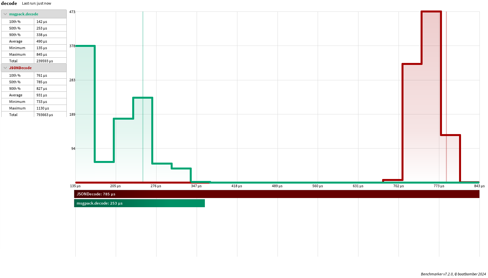
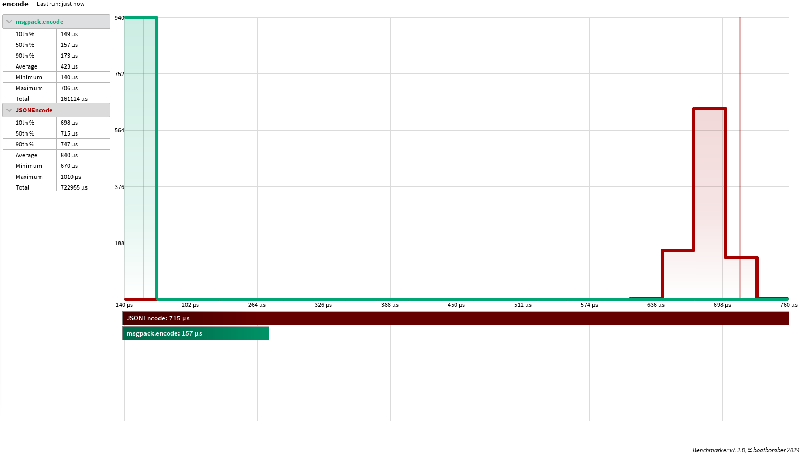
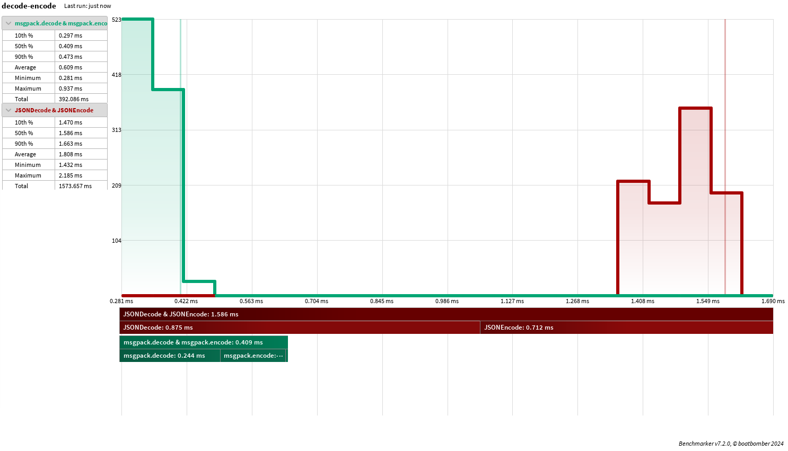

<!-- Project links -->
[latest release]: https://github.com/cipharius/msgpack-luau/releases/latest

<!-- Images -->
[shield wally release]: https://img.shields.io/endpoint?url=https://runkit.io/clockworksquirrel/wally-version-shield/branches/master/cipharius/msgpack-luau&color=blue&label=wally&style=flat

# MessagePack for Luau

[![Wally release (latest)][shield wally release]][latest release]

A pure MessagePack binary serialization format implementation in Luau.

# Goals

* Fulfill as much of MessagePack specification, as Luau allows
* Be on par with HttpService's `JSONEncode` and `JSONDecode` performance wise
* Keep code readable as long as it does not get in the way of prior goals

## Example usage

```lua
local msgpack = require(path.to.msgpack)
local message = msgpack.encode({"hello", "world", 123, key="value"})

for i,v in pairs(msgpack.decode(message)) do
  print(i, v)
end

-- To store MessagePack message in DataStore, it first needs to be wrapped in UTF8 format
-- This is not nescessary for HttpService or RemoteEvents!
local dataStore = game:GetService("DataStoreService"):GetGlobalDataStore()
dataStore:SetAsync("message", msgpack.utf8Encode(message))

local retrieved = msgpack.utf8Decode(dataStore:GetAsync("message"))
for i,v in pairs(msgpack.decode(retrieved)) do
  print(i, v)
end
```

## API

* `msgpack.encode(data: any): string`

  Encodes any pure Luau datatype in MessagePack binary string format.
  It does not currently handle any Roblox specific datatypes.

* `msgpack.decode(message: string): any`

  Decodes MessagePack binary string as pure Luau value.

* `msgpack.utf8Encode(message: string): string`

  Wraps binary string in a UTF-8 compatible encoding.
  Nescessary to save binary strings (like MessagePack serialized data) in DataStore.

* `msgpack.utf8Decode(blob: string): string`

  Unwraps binary string from UTF-8 compatible encoding.

* `msgpack.Extension.new(extensionType: number, blob: buffer): msgpack.Extension`

  Create MessagePack extension type, which is used for custom datatype serialization purposes.
  First argument `extensionType` must be an integer.

* `msgpack.Int64.new(mostSignificantPart: number, leastSignificantPart: number): msgpack.Int64`

  Represents 64-bit signed integer, which is too large to to represent as Luau integer.
  Both arguments must be integers.

* `msgpack.UInt64.new(mostSignificantPart: number, leastSignificantPart: number): msgpack.UInt64`

  Represents 64-bit unsigned integer, which is too large to to represent as Luau integer.
  Both arguments must be integers.

## Performance

One of the project goals is to match or exceed the performance of Roblox offered data serialization and deserialization methods (HttpService's `JSONEncode` and `JSONDecode`).
To ensure fulfilment of this goal the module's methods need to be benchmarked.

To benchmark message decoding performance an approximately 210KB large JSON encoded payload has been chosen.
This JSON is then used as input for `HttpService:JSONEncode()` method and also encoded in MessagePack format so that it can be used as input for `msgpack.decode()` function.
For MessagePack encoding [an online msgpack-lite encoder](https://kawanet.github.io/msgpack-lite/) was used.

As visible in the [boatbomber's benchmarker plugin](https://devforum.roblox.com/t/benchmarker-plugin-compare-function-speeds-with-graphs-percentiles-and-more/829912) results, `msgpack.decode` considerably exceeds `JSONDecode` performance:


To benchmark module's encoding performance same data is used as previously.
It is first decoded as table structure then both `msgpack.encode` and `JSONEncode` encode it with the following results:


After transitioning to Luau buffer based encoding strategy, MessagePack encoder significantly exceeds the performance of the `JSONEncode` function.
An interesting observation can be made on how consistent is it's execution time, even in comparision with the `msgpack.decode`.
This is most likely is because `msgpack.encode` performs only a single dynamic allocation by computing the nescessary amount of bytes to encode the data and then allocates the result buffer in one go.

Here is another benchmark which combines both decoding and encoding steps and as it can be seen, thanks to much greater `msgpack.decode` speed, both methods together perform better than built-in `JSONEncode` and `JSONDecode`:


For more details on the benchmark setup, look into `./benchmark` directory.
To construct the benchmarking place, the following shell command was used: `rojo build -o benchmark.rbxl benchmark.project.json`

## State of project

Encoding and decoding fully works, extensions are currently not specially treated.
